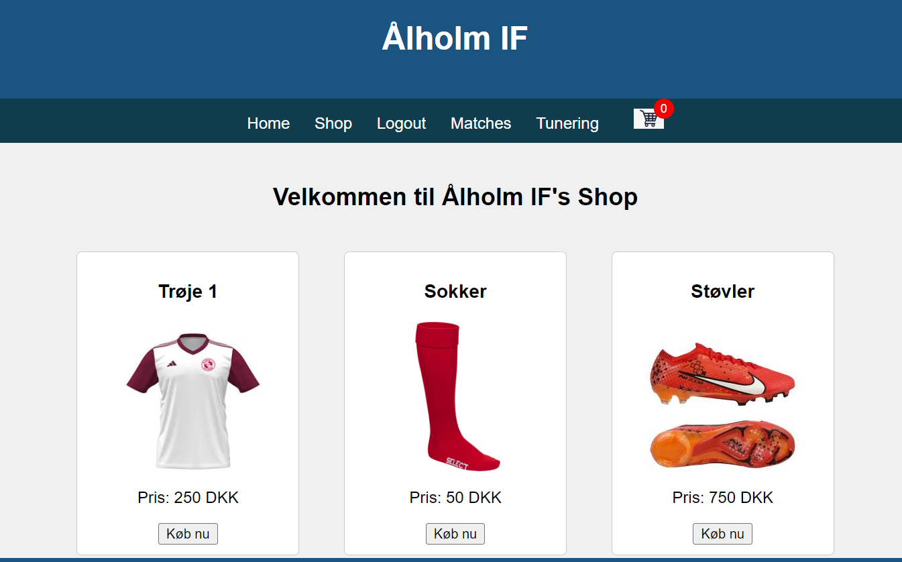

# Eksamen Fodbold tunering
 
Velkommen til Ålholm if foldbold side hvor der kan afvikles fodbold tuneringer

For at køre koden og anvende siden skal alle mapper og koder henters

Når der skal logges ind er brugen admin admin, så alle kan tilgå den der henter den.

koden består af 3 databaser en til gemme hold, en til gemme reslutater af tuneringer og en til brugerne på siden. disse databaser anvender hindanden for at gør det hele dynamisk
og lettere at tilgå

for at starte en tunering tilgå tunering tab sæt hold ind vælg dem og gem i bunden
efter dette skal man køre matches 2 filen som er en python kode. der insætter man kamp relsutater
når hele tuneringen så er køre kan man tilgå matches tab og se OnGoingTournaments og indsætte 
dden tunerings navn man vil se og så kommer der et score board op

Der også en shop på siden der kan bruges til købe fodbold tøj

koden er skrev af Isaac, Haroon og Magnus. S